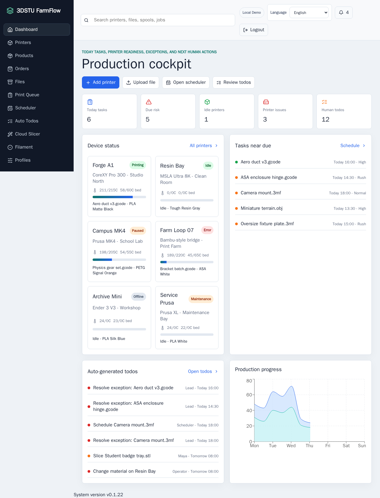
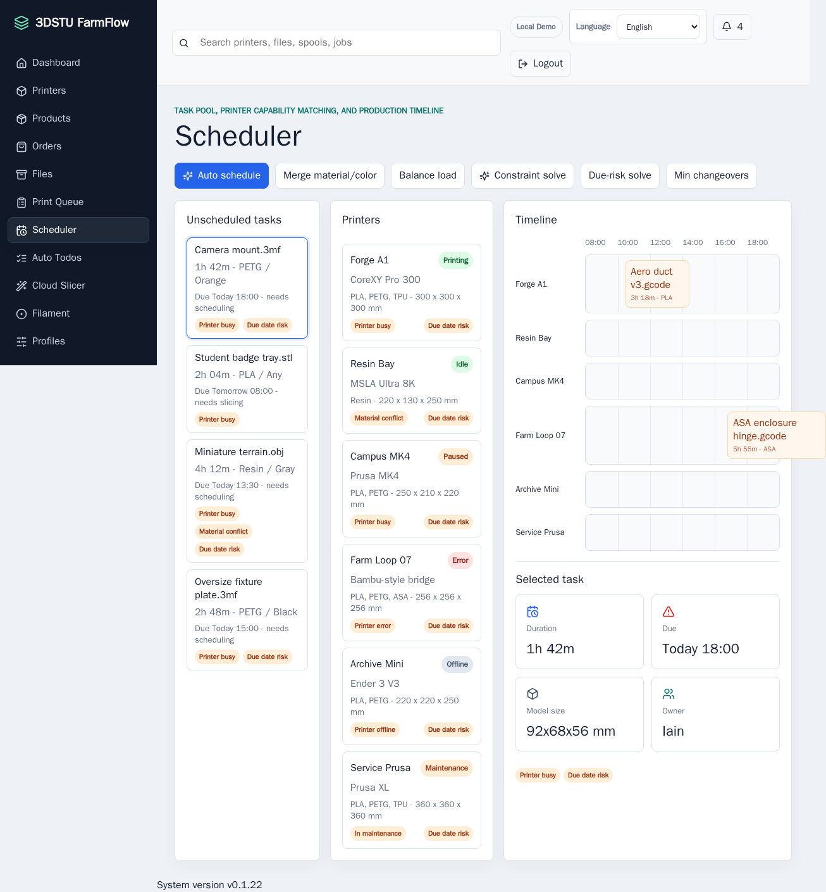
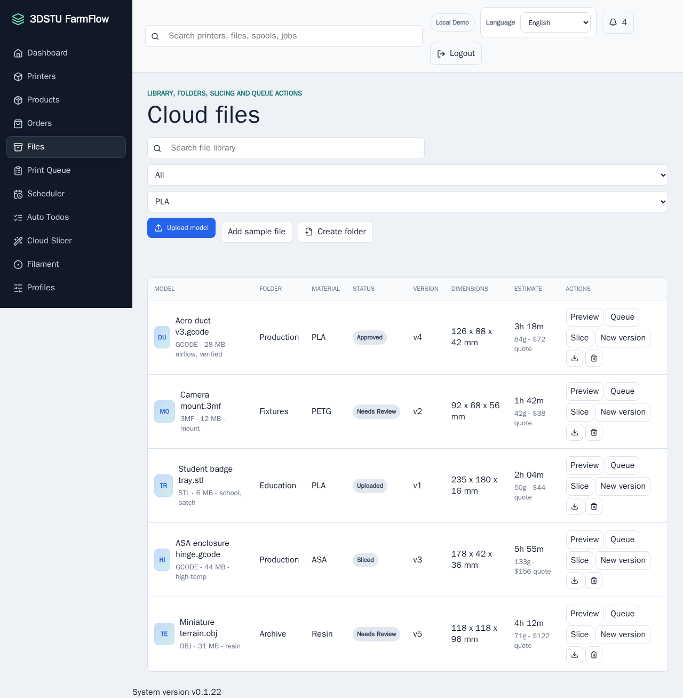
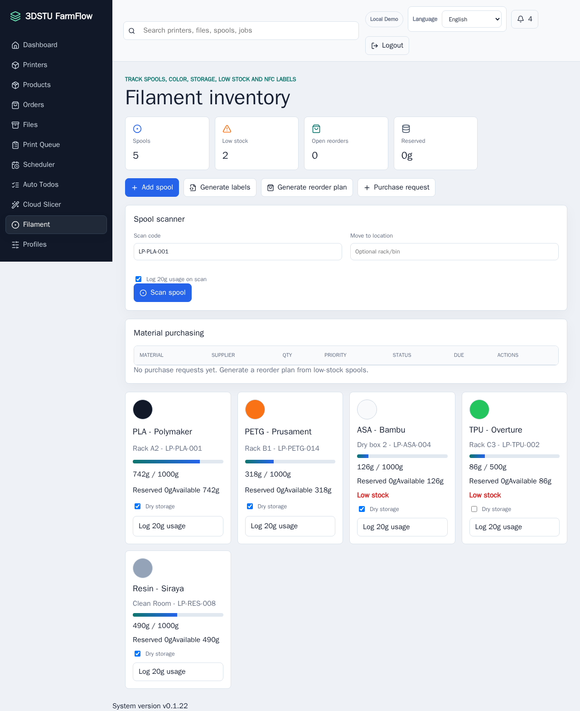
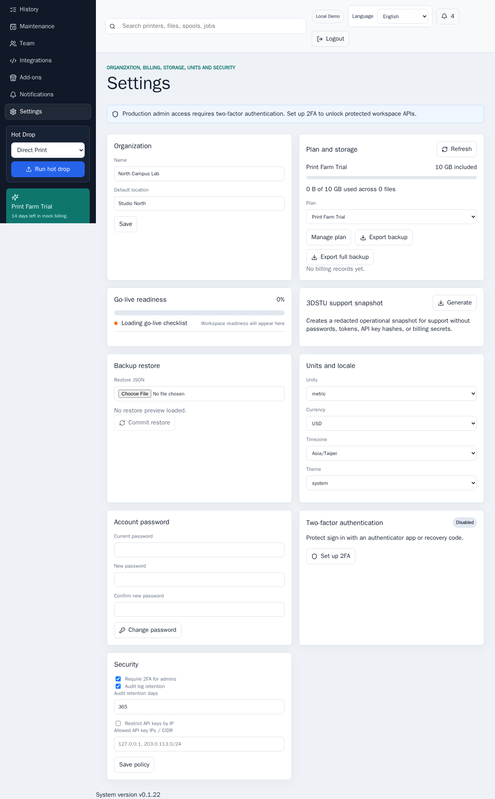

# 3DSTU FarmFlow

[](https://github.com/iain0901/3D-Printing-Farm-System/actions/workflows/ci.yml)

3DSTU FarmFlow is an original 3D printing production operating system MVP for studios, labs, and small print farms. It focuses on structured tasks, model files, printer capability matching, scheduling, automatic todos, and exception-driven operations.

Localized documentation:

- [繁體中文 README](README.zh-TW.md)
- [简体中文 README](README.zh-CN.md)
- [繁體中文授權](LICENSE.zh-TW.md)
- [简体中文许可](LICENSE.zh-CN.md)

For professional technical support or installation services, contact `support@3dstu.com`.

Project links:

- Website: https://farm-saas.3dstu.com
- GitHub: https://github.com/iain0901/3D-Printing-Farm-System
- Installation guide: docs/INSTALL.md
- Operations runbook: docs/OPERATIONS.md
- Product roadmap: docs/ROADMAP.md
- Release runbook: docs/RELEASE.md


## Platform At A Glance

3DSTU FarmFlow is built as a production-control layer for real print-farm operations, not just a printer list. The current release-candidate branch includes:

| Area | What the platform handles |
|---|---|
| Intake | Manual orders, quote requests (quick/expert forms with instant estimate), CSV/commerce import, SKU-linked job generation |
| Customers | Customer directory (CRM), auto-linked by email from quote intake, linked quote/order history and value; self-service customer account portal with quote decisions and two-way messaging |
| Files | STL/3MF/G-code library, versions, previews, generated sample models, slicer outputs |
| Scheduling | Printer matching, material/color constraints, due-risk warnings, load balancing |
| Shop floor | Printer states, queue lifecycle, operator todos, maintenance reports, history/reprints |
| Materials | Spool inventory, reservations, usage scans, reorder planning, label export |
| Operations | Roles, 2FA, audit trail, webhooks, notifications, backups, restore drills, go-live evidence |

## Actual Product Screens

These screenshots are captured from the working local demo UI in this repository.

### Production cockpit



### Scheduler and capacity planning



### Model file library



### Filament and material inventory



### Settings, backup, and governance



## Documentation Map

| Need | Start here |
|---|---|
| Install locally | [Run Locally](#run-locally) |
| Deploy on Ubuntu | [docs/INSTALL.md](docs/INSTALL.md) and [deploy/ubuntu/README.md](deploy/ubuntu/README.md) |
| Operate a live farm | [docs/OPERATIONS.md](docs/OPERATIONS.md) |
| Decide whether it is ready for production | [docs/PRODUCTION_READINESS.md](docs/PRODUCTION_READINESS.md) |
| Release and go-live flow | [docs/RELEASE.md](docs/RELEASE.md) |
| Product direction | [docs/ROADMAP.md](docs/ROADMAP.md) |
| Platform wiki | [docs/wiki/README.md](docs/wiki/README.md) |


## License

3DSTU FarmFlow is developed by 3DSTU as a free SaaS platform for 3DSTU farm customers. It is source-available under the [3DSTU Farm Customer Source-Available License](LICENSE.md): customers may run, modify, and use it internally to operate their own 3D printing farms and earn revenue from their own printed parts or production services, but may not sell, redistribute, rebrand, host, white-label, or commercially provide the software, modified versions, scripts, Docker images, or related services to third parties without a separate written agreement from 3DSTU.

## Run Locally

```bash
npm install
npm run dev
```

Then open the local Vite URL shown in the terminal, usually `http://127.0.0.1:5173`.

To run the local backend API in another terminal:

```bash
npm run api
```

The API listens on `http://127.0.0.1:8797`, persists data to `api/data/layerpilot.db.json`, and exposes:

## Run With Docker

Create a production-like environment file, then build and run the container:

```bash
cp .env.example .env
# edit .env and set your real owner email/password
docker compose up --build
```

Then open `http://127.0.0.1:8797`. Compose starts an API/web service plus a `layerpilot-worker` background service from the same image. The web container serves the built React app and Fastify API, runs as the non-root `node` user, uses `no-new-privileges`, has a 30-second graceful stop window, per-service JSON log rotation, and exposes a container healthcheck against `/api/health`. The worker runs telemetry ticks and OctoPrint, Moonraker, and PrusaLink polling, then notifies the API over an internal worker-token endpoint so WebSocket/SSE clients receive fresh state. Data is stored in the `layerpilot-data` Docker volume at `/data/layerpilot.db.json`, and uploaded model files are stored under `/data/storage` by default. Set `LAYERPILOT_OBJECT_STORAGE_PROVIDER=s3` to use S3-compatible object storage instead.

## Deploy On Ubuntu

Ubuntu 22.04/24.04 deployment assets live in `deploy/ubuntu/`.

Fast path on a fresh server:

```bash
chmod +x scripts/ubuntu-deploy.sh
LAYERPILOT_ADMIN_EMAIL=owner@example.com \
LAYERPILOT_ADMIN_PASSWORD='replace-with-a-long-password' \
LAYERPILOT_WORKSPACE_NAME='My Print Farm' \
scripts/ubuntu-deploy.sh deploy
```

The script creates `.env` with shell/Compose-safe quoted production values, generated worker/metrics tokens when needed, a `LAYERPILOT_PUBLIC_URL` for live smoke checks, and a localhost bind by default for Nginx proxying. It runs a `doctor` preflight for deployment files, private `.env` permissions, production secrets, password/token strength, environment value formats, optional S3/Stripe/MQTT configuration consistency, and Compose config before building Docker Compose services, waiting for readiness, and running smoke checks. Compose uses the project name `layerpilot` by default (override with `COMPOSE_PROJECT_NAME` for co-hosted customer environments), so the persistent Docker volume is `layerpilot_layerpilot-data` unless overridden. For a public domain with Nginx and HTTPS, follow `deploy/ubuntu/README.md`; after the app is placed under `/opt/layerpilot`, `scripts/ubuntu-setup.sh all your-domain.example owner@example.com` installs base dependencies, UFW firewall rules, Docker log rotation, the backup timer, an ops-check timer, the Nginx site with WebSocket/SSE-friendly proxying and browser security headers, and Certbot HTTPS. Use `scripts/ubuntu-go-live-check.sh` on the Ubuntu host to load `.env`, run Bash syntax checks, setup preflight, deployment doctor, optional host QC, live smoke checks, verified backup, restore drill, and ops-check in one pass; successful runs write a sanitized `release/go-live-evidence-*.md` report for release handoff, including skipped-check reasons while omitting secrets and private env-file paths, or use `LAYERPILOT_GO_LIVE_REPORT` for a fixed path. Use `scripts/ubuntu-deploy.sh update` for normal releases; it runs preflight, optional host QC, verified volume backup, deploy, readiness, and smoke checks. In `NODE_ENV=production`, `/api/readiness` also validates optional dependency configuration for S3 object storage, Stripe billing, and MQTT so a live instance fails readiness when those integrations are only partially or invalidly configured; when `LAYERPILOT_WORKER_TELEMETRY` or `LAYERPILOT_WORKER_BRIDGE_POLLING` is enabled, readiness also requires a fresh durable worker heartbeat. Use `scripts/ubuntu-deploy.sh rollback <archive.tgz>` to restore a known-good volume backup, then automatically run readiness, smoke, and ops checks; restore creates a pre-restore safeguard backup of the current production volume before replacing it. Use `scripts/ubuntu-deploy.sh ops-check` after deployment to verify services, health endpoints, authenticated state and audit access when credentials are configured, metrics-token access, backup state, timer state, disk space, and log rotation; `layerpilot-ops-check.timer` can run the same check every 15 minutes through systemd. Use `scripts/ubuntu-deploy.sh support-bundle` to generate a redacted troubleshooting archive with OS, Docker, health, logs, backup, and timer evidence; API support snapshots redact secret-like fields and URL paths/query strings while preserving host hints. Use `scripts/ubuntu-backup.sh backup` before manual upgrades, run `scripts/ubuntu-backup.sh restore-drill <archive.tgz>` to test restores without touching production data, or install the included `layerpilot-backup.timer` for nightly verified backups with locking and 30-day pruning; the backup helper reads `.env` before applying defaults.

After deployment, run a production smoke check from the host:

```bash
LAYERPILOT_SMOKE_URL=http://127.0.0.1:8797 \
LAYERPILOT_SMOKE_EMAIL=owner@example.com \
LAYERPILOT_SMOKE_PASSWORD=change-this-password \
npm run smoke:prod
```

### Hosting Multiple Customer Environments On One Host

3DSTU FarmFlow is single-tenant per deployment: there is no self-service signup, so every customer gets their own independently provisioned instance with its own bootstrap Owner. `scripts/provision-tenant.sh` scaffolds that environment without touching Docker itself:

```bash
scripts/provision-tenant.sh \
  --slug acme-lab \
  --admin-email owner@acme.example \
  --domain farm.acme.example \
  --host-port 8798
```

This writes a private `tenants/<slug>/<slug>.env` (mode `600`) with a unique `COMPOSE_PROJECT_NAME`, `LAYERPILOT_CONTAINER_NAME`, and `LAYERPILOT_HOST_PORT` plus generated worker/metrics tokens and a generated Owner password (shown once), and an optional Nginx vhost file when `--domain` is given. Each environment's Compose project, container names, host port, and data volume are isolated, so several customers can share one host. Copy the generated `.env` into place (or set `LAYERPILOT_ENV_FILE`) and continue with the normal `scripts/ubuntu-deploy.sh doctor` / `deploy` flow. Use `--dry-run` to preview output without writing files, and `--force` to intentionally rotate an existing environment's secrets.

Useful production environment variables:

- `LAYERPILOT_HOST`, default `0.0.0.0` in Docker
- `LAYERPILOT_API_PORT`, default `8797`
- `LAYERPILOT_HOST_PORT`, host port published on `LAYERPILOT_BIND_ADDRESS` by Docker Compose, default `8797`; give each co-hosted customer environment a unique value
- `COMPOSE_PROJECT_NAME` and `LAYERPILOT_CONTAINER_NAME`, Compose project and container identity, default `layerpilot`; `scripts/provision-tenant.sh` sets these per customer so multiple environments can share one host without collisions
- `LAYERPILOT_PUBLIC_URL`, public app URL used by smoke checks, links, and production CORS trusted-origin defaults
- `LAYERPILOT_CORS_ORIGINS`, optional comma-separated extra trusted browser origins for cross-origin quote portals or admin frontends; production rejects wildcard or non-HTTP(S) origins
- `LAYERPILOT_DB_PATH`, default `/data/layerpilot.db.json` in Docker
- `LAYERPILOT_DB_ADAPTER`, `json` by default; set to `sqlite` with a `.sqlite` DB path for SQLite-backed document persistence
- `LAYERPILOT_STORAGE_DIR`, default `/data/storage` in Docker
- `LAYERPILOT_OBJECT_STORAGE_PROVIDER`, `local` or `s3`, default `local`
- `LAYERPILOT_S3_BUCKET`, `LAYERPILOT_S3_REGION`, `LAYERPILOT_S3_ENDPOINT`, `LAYERPILOT_S3_PREFIX`, `LAYERPILOT_S3_FORCE_PATH_STYLE`, `LAYERPILOT_S3_ACCESS_KEY_ID`, and `LAYERPILOT_S3_SECRET_ACCESS_KEY`, optional S3-compatible object storage configuration
- `LAYERPILOT_SERVE_STATIC`, set to `true` to serve `dist`
- `LAYERPILOT_ADMIN_EMAIL` and `LAYERPILOT_ADMIN_PASSWORD`, optional bootstrap Owner credentials for first deployment
- `LAYERPILOT_ADMIN_NAME`, optional bootstrap Owner display name
- `LAYERPILOT_WORKSPACE_NAME`, optional workspace name applied during bootstrap
- `LAYERPILOT_DISABLE_DEFAULT_USERS`, set to `true` for fresh production deployments to remove seeded default users
- `LAYERPILOT_DISABLE_DEMO_LOGIN`, set to `true` to prevent auto-creating the demo login
- `LAYERPILOT_SESSION_TTL_HOURS`, user session lifetime, default `168` hours
- `LAYERPILOT_SESSION_IDLE_TIMEOUT_HOURS`, idle user session timeout, default `24` hours
- `LAYERPILOT_AUTH_LOCK_THRESHOLD`, known-account failed login/2FA attempts before temporary lock, default `5`
- `LAYERPILOT_AUTH_LOCK_MINUTES`, temporary known-account auth lock duration, default `15`
- Workspace API-key IP restrictions accept only explicit IPv4 addresses or IPv4 CIDR ranges such as `203.0.113.25` or `203.0.113.0/24`; if restrictions are enabled with an empty or invalid allowlist in production, `/api/readiness` fails until the settings are corrected.
- `LAYERPILOT_METRICS_TOKEN`, optional token for Prometheus-style `/api/metrics` scraping without a user session; production scrapers must send it with the `x-layerpilot-metrics-token` header, not a URL query parameter
- `LAYERPILOT_OPS_EMAIL` and `LAYERPILOT_OPS_PASSWORD`, optional dedicated smoke account for `scripts/ubuntu-deploy.sh ops-check`; blank values fall back to the bootstrap admin credentials
- `LAYERPILOT_AUTO_BACKUP_ON_MIGRATE`, defaults to `true`; writes a sibling `*.pre-migration-*.bak.json` before schema migrations when an existing DB file is upgraded
- `LAYERPILOT_PRE_RESTORE_BACKUP`, defaults to `true`; writes a safeguard volume archive before restore or rollback replaces production data
- `LAYERPILOT_FULL_BACKUP_MAX_BYTES`, default `536870912` (512 MiB); caps `/api/admin/export?includeFiles=true` before stored model/G-code bytes are read into the JSON response, and full exports fail closed when referenced stored files are missing unless `allowMissingFiles=true` is supplied intentionally
- `LAYERPILOT_WORKER_TOKEN`, required for Docker worker-to-API state broadcasts; change the example value before real deployment. In production, worker broadcasts must send it with the `x-layerpilot-worker-token` header, not a URL query parameter.
- `LAYERPILOT_WORKER_TELEMETRY` and `LAYERPILOT_WORKER_BRIDGE_POLLING`, enable or disable background worker jobs; when either is enabled in production, `/api/readiness` fails until the worker has reported a recent heartbeat
- `LAYERPILOT_WORKER_TELEMETRY_INTERVAL_MS` and `LAYERPILOT_WORKER_BRIDGE_POLL_INTERVAL_MS`, background worker intervals used by readiness to calculate worker heartbeat freshness with a minimum 60-second tolerance
- `LAYERPILOT_BILLING_PORTAL_URL`, optional external billing portal destination
- `LAYERPILOT_STRIPE_SECRET_KEY`, optional Stripe API secret key for subscription checkout and billing portal sessions
- `LAYERPILOT_STRIPE_WEBHOOK_SECRET`, required in production when `/api/billing/webhook/stripe` is exposed; direct Stripe calls are verified with the `Stripe-Signature` header, while trusted edge proxies may inject `x-layerpilot-billing-webhook-secret`
- `LAYERPILOT_STRIPE_PRICE_STUDIO`, `LAYERPILOT_STRIPE_PRICE_FARM`, and `LAYERPILOT_STRIPE_PRICE_ENTERPRISE`, optional Stripe recurring price IDs mapped to 3DSTU FarmFlow plans
- `LAYERPILOT_MQTT_URL`, optional MQTT broker URL used by the MQTT Event Stream add-on when it is enabled
- `LAYERPILOT_MQTT_TOPIC_PREFIX`, optional MQTT topic prefix, default `layerpilot`
- `LAYERPILOT_MQTT_USERNAME` and `LAYERPILOT_MQTT_PASSWORD`, optional MQTT broker credentials
- `LAYERPILOT_MQTT_QOS`, optional MQTT QoS value `0`, `1`, or `2`
- `LAYERPILOT_MQTT_RETAIN`, optional `true`/`false` retained-message flag
- `LAYERPILOT_SLICER_CMD`, optional external slicer executable such as PrusaSlicer, OrcaSlicer, or SuperSlicer
- `LAYERPILOT_SLICER_ARGS`, optional JSON array or space-separated args using `{input}`, `{output}`, and `{config}` placeholders
- `LAYERPILOT_SMTP_HOST`, optional SMTP host; when unset, customer portal transactional email (password reset, quote-ready, new-message notices) is silently skipped
- `LAYERPILOT_SMTP_PORT`, SMTP port, default `587`
- `LAYERPILOT_SMTP_SECURE`, optional `true`/`false`; defaults to `true` only when the port is `465`
- `LAYERPILOT_SMTP_USER` and `LAYERPILOT_SMTP_PASSWORD`, optional SMTP credentials
- `LAYERPILOT_SMTP_FROM`, the From address for customer portal transactional email, defaults to `LAYERPILOT_SMTP_USER`

The production API also enables security headers through `@fastify/helmet` and route-level rate limiting through `@fastify/rate-limit` for authentication, API key creation, billing sessions, and admin exports. This is a single-tenant deployment model: there is no self-service signup route, so each customer gets an independently provisioned environment (see "Hosting Multiple Customer Environments On One Host" above) with its own bootstrap Owner account, and additional operators are added from the Team page by that Owner. Production CORS reflects only the origin from `LAYERPILOT_PUBLIC_URL` plus any comma-separated `LAYERPILOT_CORS_ORIGINS` entries; wildcard and non-HTTP(S) origins fail readiness. API-key IP allowlists are validated as IPv4 addresses or IPv4 CIDR ranges at settings write time, and production readiness fails if a persisted allowlist is empty or invalid while API-key IP restrictions are enabled. User session and API-key credentials are rejected from URL query parameters in production; browser realtime clients request a short-lived `/api/events/token` ticket with the normal `Authorization` header and use that one-time ticket for WebSocket or SSE URLs instead of exposing the long-lived bearer token. Stripe billing webhooks are deduplicated by provider `event.id`, so duplicate deliveries return `x-layerpilot-stripe-webhook-replay: true` and do not create duplicate `billing.stripe_webhook` audit evidence.

Authenticated admins can run `/api/admin/integrity?checkStorage=true` before backup or restore drills to verify stored model/G-code object coverage. The report includes expected stored payloads, present payloads, total bytes, missing objects, and a `complete` flag so missing local or S3 file bytes are visible before an export or restore is trusted. The `admin.integrity_checked` audit event records whether storage was checked, whether coverage was complete, byte/count totals, and the missing-file count without storing file contents. `npm run smoke:prod` and `scripts/ubuntu-deploy.sh ops-check` run the same storage-aware integrity check whenever authenticated smoke credentials are configured, and they fail if `storage.complete` is false.

Authenticated direct file creation writes `file.created` audit events with workspace/operator context, file ID/name/type/material, status, version, and whether the record is storage-backed. Authenticated model and G-code downloads write `file.downloaded` audit events with workspace/operator context, file ID/name/type, storage-backed versus fallback-manifest status, and byte count. Authenticated previews write `file.previewed` events with the same file identity and storage-backed context plus preview kind and byte count. Authenticated file deletion writes `file.deleted` events with workspace/operator context, file identity, storage-backed status, storage cleanup result, force flag, and compact reference counts. Audit metadata does not include file contents, local storage paths, object-storage keys, or raw reference records.

Backend slicer jobs and quick file-slice actions write `slicer.completed`, `slicer.failed`, or `file.sliced` audit events with workspace/operator context, slicer job ID, source file ID, printer/profile IDs, engine, material settings, status, and output size. These records do not include generated G-code bodies, slicer command arguments, local output paths, config paths, or object-storage keys.

Slicer profile creation, import, update, default selection, matching-policy updates, archive actions, and production-template create/update/run actions write workspace/operator audit events. These records include compact profile/template IDs, kind/source/target, file/printer/material/quantity/priority, policy flags, and generated job counts without storing full profile settings, template notes, or generated queue response bodies.

Generated sample files, Hot Drop handling, parametric nameplate generation, file-folder creation/reuse, and printer capability create/update actions also write workspace/operator audit events. These records include compact file, folder, job, part, printer, material, build-volume, and byte-count metadata for production traceability without storing generated STL bodies, local storage paths, object-storage keys, or printer credentials.

Real printer actions such as pause, resume, cancel, home, preheat, and cooldown write `printer.action` audit events with workspace/operator, printer, job, action, previous-state, and bridge identity metadata. These records do not include bridge API keys or endpoint URLs.

Printer bridge configuration, diagnostic tests, and operator-triggered syncs write `bridge.saved`, `bridge.connected`, `bridge.diagnostic_failed`, and `bridge.poll` audit events with workspace/operator context, bridge/printer IDs, bridge kind, enabled state, endpoint host, credential-presence flags, and sync counts. These records do not include bridge API keys, full endpoint URLs, endpoint paths, or query-string tokens.

Authenticated catalog CSV exports are scoped to the requesting workspace and write `catalog.exported` audit events with row and catalog object counts, without storing the exported CSV body. Audit CSV exports write `admin.audit_exported` events with export filters, matched counts, and exported event counts, also without storing exported evidence rows.

Operator quote reviews, customer portal-link generation/rotation, quote conversion, manual order creation, order status changes, SKU-linked job generation, and part/SKU setup writes create workspace/operator audit events. These records include compact quote, order, job, part, SKU, status, value, stock, and generated-job counts without storing quote customer notes, internal notes, portal bearer tokens, or full generated job response bodies.

Inventory and maintenance audit events for spool creation, label export, scan/usage/update, purchase request creation/reorder/update/receive, maintenance job creation/update, templates, and problem reports include workspace and authenticated operator context so physical material and service-log changes can be reviewed after production incidents.

Webhook, notification channel, and commerce connector create/update audit events plus webhook and notification test-send events include workspace and authenticated operator context. These events record compact endpoint identity, enabled status, subscribed event names, channel type, recipient count, and whether a token exists without storing endpoint URLs, URL paths/query strings, or bearer tokens.

When `NODE_ENV=production` and workspace `requireAdmin2fa` is enabled, logged-in Owner and Admin users must enroll TOTP two-factor authentication before protected production APIs are available. Unenrolled admin sessions can still call `/api/auth/me`, `/api/auth/change-password`, `/api/auth/2fa/setup`, `/api/auth/2fa/enable`, and `/api/auth/logout` so they can remediate without exposing workspace state or admin actions. Enabling TOTP requires the current account password in addition to the authenticator code, and failed password-proof or invalid-code attempts create sanitized `auth.2fa_enable_failed` evidence without submitted passwords, TOTP secrets, or codes. Production Owner/Admin users cannot disable TOTP while `requireAdmin2fa` remains enabled; disable the workspace policy first if an account needs a controlled 2FA reset. Failed password and failed TOTP/recovery-code login attempts create `auth.login_failed` and `auth.2fa_failed` audit events with workspace/user context for known accounts plus compact IP/user-agent hints, without storing submitted passwords, TOTP codes, or recovery codes. After `LAYERPILOT_AUTH_LOCK_THRESHOLD` failed known-account password or 2FA attempts, the account is temporarily locked for `LAYERPILOT_AUTH_LOCK_MINUTES`; locked attempts return `423`, create `auth.login_locked` evidence, and the lock clears on successful authentication after expiry, user password change, or Owner/Admin password reset.

Retry-prone order, queue, queue matching, scheduler automation, telemetry tick, file folder, multipart model upload, file/model artifact, slicer job/file-slice, todo action, history annotation/reprint, webhook test, notification test, commerce connector test/import, bridge diagnostic/sync, printer action, direct printer status, public quote intake, public quote decision, quote update, quote portal-link generation or rotation, quote conversion, production-template, catalog/profile/printer configuration, catalog governance, integration configuration, governance setup, admin account management, inventory, maintenance, filament purchasing, billing, and audit-retention writes accept an `Idempotency-Key` header. Supported routes replay the original successful response for the same actor, route, key, and body, and return `409` when a key is reused with different input. Queue lifecycle retries for schedule, status, and priority updates replay without duplicating `queue.scheduled`, `queue.status`, or `queue.priority` audit events, and schedule/complete/cancel replays do not double-reserve, double-consume, or double-release spool inventory. Order lifecycle retries replay status changes without duplicating `order.status` audit events; cancellation retries replay the original generated-job cascade and material release instead of releasing the same reservation twice. Queue matching retries replay the first committed assignment response without duplicating `queue.matched` audit events. Scheduler retries replay auto, optimized, and constraint scheduling responses without duplicating scheduling audit events. Telemetry tick retries replay the first progress response without double-advancing printer progress or prematurely completing jobs after a dropped API response. File folder retries replay the original create/reuse response without duplicating `file_folder.created` or `file_folder.reused` audit events. Multipart model upload retries replay the original parsed file response without duplicating stored files, stored bytes, or upload audit events. File/model artifact retries replay generated sample models, Hot Drop handling, parametric nameplates, metadata-created files, file deletion, and manual file-version bumps without creating duplicate stored model records, linked catalog parts, duplicate Hot Drop queue jobs, or duplicate file-version audit events. Slicer retries replay completed job/file-slice responses without creating duplicate slicer job records, G-code artifacts, file-version increments, or slicer audit events. Todo action retries replay without creating duplicate claim, snooze, complete, or reopen records. History annotation retries replay issue/waste updates without double-deducting spool inventory or duplicating `history.annotated` audit events. History reprint retries replay the first queued reprint job without creating duplicate queue jobs, todos, or `queue.reprint` audit events. Webhook, notification, and commerce connector test retries replay without creating duplicate test events, delivery logs, or outbound test calls to external endpoints. Bridge diagnostic and sync retries replay before polling printer endpoints again, avoiding duplicate bridge audit events and repeated hardware status calls after dropped operator responses. Printer action retries replay before dispatching another bridge command, so pause/resume/cancel retries do not double-send to real hardware. Direct printer status retries replay the first status response without duplicating `printer.status` audit events. Catalog, slicer profile, production-template creation/run, and printer capability setup retries replay without creating duplicate records, queue jobs, or duplicate setup/run audit events. Integration configuration retries replay webhook, notification channel, commerce connector, add-on, and bridge setup responses without duplicating connector records or setup audit events. Governance setup retries replay workspace setting updates, onboarding checklist changes, and support snapshot generation without duplicating settings, onboarding, or support audit events. Admin account retries replay API-key create/update, user invite/update, and password-reset responses without rotating generated secrets again or duplicating governance audit events, but generated secret fields are redacted from the persisted replay body and from replay responses. Cost catalog and material-map retries replay without duplicating pricing or material-normalization audit/run records. Inventory retries cover spool creation, spool metadata updates, spool usage, scan-based usage/location updates, and spool label exports; label export retries return the original CSV/HTML artifact without duplicating `spool.labels_generated` audit events. Maintenance retries cover job creation, job updates, templates, and problem reports without duplicating maintenance audit events. Filament purchasing retries cover direct purchase-request create/update, reorder planning, and receive-to-inventory workflows without duplicating reorder records, update events, or received spools. Quote update retries replay reviewed quote responses without duplicating quote update audit events. Quote portal-link rotation retries do not rotate again or invalidate the link already shown to an operator; generated portal token fields and token-bearing URLs are redacted from persisted replay bodies and replay responses. The shipped public quote form, quote portal decision controls, daily operator controls for queue scheduling/status/priority/matching, scheduler automation, order creation/lifecycle/job generation, operator quote update/link/convert actions, file folder creation, model upload, file sample/version/delete/slice actions, Hot Drop, slicer jobs, production-template save/run controls, parametric nameplate generator, printer bridge actions, direct printer status controls, commerce connector test/import/CSV intake controls, spool creation/update/usage/scan/labels, maintenance job updates, generated todo actions, filament purchase requests/reorder/receive, team account controls, API-key controls, workspace settings, onboarding checklist, support snapshot, and billing controls generate and reuse idempotency keys for the same attempted payload until the request succeeds. Replay records are internal server metadata only; shared state and admin exports omit the idempotency ledger, and the persisted ledger replaces secret-like response fields with `REDACTED`.

Confirmed workspace restore commits on `/api/admin/restore` also accept an `Idempotency-Key`. Because a successful restore intentionally revokes existing sessions, an exact retry of the same committed restore payload can replay the original success response even after the old session token is no longer valid. Restore previews remain authenticated dry-runs and are not exposed through this post-commit replay path.
Restore preview and commit summaries include `filePayloadCoverage` metadata for stored model/G-code files: expected payloads, included payloads, missing payloads, extra payloads, and whether the backup is complete for stored bytes. The Settings restore panel surfaces the same coverage so operators can stop before committing a JSON restore that would leave files marked for re-upload.
Committed restores add `admin.restore_prepared` evidence to the restored audit timeline with workspace/operator context, collection counts, warning count, stripped-storage-path count, restored file-payload count, and compact file-payload coverage counts. This evidence does not store restored record names, customer/user emails from the backup, storage paths, file payload bytes, or backup contents.

- `GET /api/health`
- `GET /api/readiness`
- `GET /api/metrics`
- `POST /api/internal/worker-broadcast` (internal worker token only)
- `POST /api/auth/login`
- `GET /api/auth/me`
- `POST /api/auth/2fa/setup`
- `POST /api/auth/2fa/enable`
- `POST /api/auth/2fa/disable`
- `POST /api/auth/change-password`
- `POST /api/auth/logout`
- `GET /api/printers`
- `GET /api/files`
- `GET /api/queue`
- `GET /api/todos`
- `POST /api/todos/:id/action`
- `GET /api/spools`
- `GET /api/maintenance`
- `GET /api/users`
- `GET /api/parts`
- `GET /api/skus`
- `GET /api/orders`
- `GET /api/profiles`
- `GET /api/addons`
- `PATCH /api/addons/:id`
- `GET /api/webhooks`
- `GET /api/events`
- `GET /api/events/stream`
- `POST /api/events/token`
- `GET /api/webhookDeliveries`
- `GET /api/mqttDeliveries`
- `GET /api/notificationChannels`
- `GET /api/notificationDeliveries`
- `GET /api/commerceConnectors`
- `GET /api/commerceImports`
- `GET /api/apiKeys`
- `GET /api/workspaceSettings`
- `GET /api/onboarding`
- `GET /api/bridges`
- `GET /api/schedule/diagnostics`
- `POST /api/schedule/auto`
- `POST /api/schedule/optimize`
- `POST /api/schedule/constraint`
- `GET /api/analytics`
- `GET /api/state`
- `GET /api/events/ws`
- `GET /api/admin/integrity`
- `POST /api/telemetry/tick`
- `POST /api/printers`
- `PATCH /api/printers/:id`
- `POST /api/files`
- `POST /api/files/upload`
- `POST /api/file-folders`
- `POST /api/files/sample`
- `POST /api/hot-drop`
- `GET /api/files/:id/download`
- `DELETE /api/files/:id`
- `POST /api/spools`
- `POST /api/spools/labels`
- `GET /api/spools/scan?code=...`
- `POST /api/spools/scan`
- `PATCH /api/spools/:id`
- `PATCH /api/spools/:id/usage`
- `POST /api/maintenance`
- `PATCH /api/maintenance/:id`
- `POST /api/maintenance/templates`
- `POST /api/maintenance/reports`
- `PATCH /api/profiles/:id/default`
- `PATCH /api/profile-policy`
- `POST /api/orders`
- `PATCH /api/orders/:id/status`
- `GET /api/customers`
- `POST /api/customers`
- `PATCH /api/customers/:id`
- `DELETE /api/customers/:id`
- `POST /api/customer-auth/register`
- `POST /api/customer-auth/login`
- `POST /api/customer-auth/logout`
- `GET /api/customer-auth/me`
- `POST /api/customer-auth/claim` to set a portal password from an existing quote ID and tracking token
- `POST /api/customer-auth/request-reset` and `POST /api/customer-auth/reset` for self-service password reset (does not reveal whether an email has an account)
- `PATCH /api/customer-auth/profile` for a signed-in customer to update their own name, phone, company, or LINE ID
- `GET /api/customer/quotes` and `GET /api/customer/orders`, scoped to the authenticated customer's own records
- `POST /api/customer/quotes/:id/decision` (customer-authenticated equivalent of the public token decision route)
- `POST /api/customer/quotes/:id/messages` and `POST /api/quoteRequests/:id/messages` for the two-way customer/operator message thread on a quote
- `PATCH /api/orders/:id/tracking` for operator-entered shipment carrier and tracking number
- `POST /api/parts`
- `PATCH /api/parts/:id`
- `POST /api/profiles`
- `POST /api/profiles/import`
- `PATCH /api/profiles/:id`
- `DELETE /api/profiles/:id`
- `POST /api/skus`
- `PATCH /api/skus/:id`
- `POST /api/orders/:id/generate-jobs`
- `POST /api/webhooks`
- `PATCH /api/webhooks/:id`
- `POST /api/webhooks/:id/test`
- `POST /api/notificationChannels`
- `PATCH /api/notificationChannels/:id`
- `POST /api/notificationChannels/:id/test`
- `POST /api/commerceConnectors`
- `PATCH /api/commerceConnectors/:id`
- `POST /api/commerceConnectors/:id/test`
- `POST /api/commerceConnectors/:id/import`
- `POST /api/commerce/import-csv`
- `POST /api/apiKeys`
- `PATCH /api/apiKeys/:id`
- `POST /api/users`
- `PATCH /api/users/:id`
- `POST /api/users/:id/reset-password`
- `PATCH /api/workspaceSettings`
- `PATCH /api/onboarding/:id`
- `POST /api/support/snapshot`
- `GET /api/billing`
- `PATCH /api/billing/plan`
- `POST /api/billing/portal`
- `POST /api/billing/webhook/stripe`
- `GET /api/costCatalog` for the authenticated workspace's pricing catalog
- `PATCH /api/costCatalog`
- `POST /api/quotes`
- `GET /api/catalog/export` for workspace-scoped SKU/material CSV exports with compact `catalog.exported` audit evidence
- `POST /api/catalog/material-map`
- `POST /api/parametric/nameplate`
- `GET /api/analytics`
- `GET /api/history`
- `GET /api/audit` with optional `type`, `search`, `limit`, and `offset` filters; responses include raw total, matched count, returned count, and `hasMore` pagination metadata
- `GET /api/audit/export` with matching `type`, `search`, `limit`, and `offset` filters for scoped CSV audit evidence and compact `admin.audit_exported` audit evidence
- `POST /api/admin/audit-retention/run`
- `PATCH /api/history/:id`
- `POST /api/history/:id/reprint`
- `GET /api/admin/export` with optional `?includeFiles=true` for a full backup containing stored model/G-code bytes; full byte exports are capped by `LAYERPILOT_FULL_BACKUP_MAX_BYTES` and return `413` with a storage manifest when the export is too large for an API JSON response, or `409` when referenced stored file payloads are missing. Use `allowMissingFiles=true` only when a partial JSON backup is intentional and file bytes are covered by separate volume/object-storage recovery.
- `POST /api/admin/restore`
- `POST /api/orders/:id/generate-jobs` with optional `{ "dryRun": true }` for SKU/part/stock preflight and duplicate-generation protection
- `POST /api/queue`
- `POST /api/queue/match`
- `POST /api/bridges`
- `POST /api/bridges/sync`
- `POST /api/bridges/:id/test`
- `POST /api/printers/:id/sync`
- `PATCH /api/printers/:id/status`
- `PATCH /api/queue/:id/schedule`
- `PATCH /api/queue/:id/status`
- `PATCH /api/queue/:id/priority`
- `PATCH /api/files/:id/version`
- `GET /api/slicer/jobs`
- `POST /api/slicer/jobs`
- `PATCH /api/files/:id/slice`
- `POST /api/actions` for persisted printer actions (`start`, `pause`, `resume`, `cancel`, `home axes`, `preheat`, `cooldown`) with queue-job synchronization and optional bridge dispatch

To run the QC suite:

```bash
npm run qc
```

This runs the TypeScript/Vite production build plus API tests.

GitHub Actions runs the same QC gate on every push to `main` and every pull request. Release discipline and VPS deployment evidence are documented in `docs/RELEASE.md`.

Before using a customer deployment for live production, complete the checklist in `docs/PRODUCTION_READINESS.md`.

## Open Source Stack

- React, Vite, TypeScript, Recharts, and Lucide React for the app experience.
- Fastify and `@fastify/cors` for the backend API.
- `@fastify/helmet` and `@fastify/rate-limit` for production security headers and sensitive-route throttling.
- `@fastify/multipart` for production model uploads.
- LowDB-compatible persistence with a local JSON adapter for simple development and an optional `node:sqlite` adapter for SQLite-backed document storage.
- AWS SDK S3 client for optional S3-compatible model and G-code object storage.
- JSZip for reading 3MF model packages.
- Stripe's official Node SDK for optional subscription checkout, billing portal sessions, and Stripe-compatible billing webhook handling.
- MQTT.js for publishing production events to broker-backed automation systems.
- Zod for API payload validation.
- Native `fetch` bridge adapters for OctoPrint, Moonraker/Klipper, and PrusaLink HTTP APIs.
- Vitest for QC coverage of backend health, readiness and Prometheus-style metrics, Docker/Compose deployment packaging, production Owner bootstrap, default-user disabling, schema migration metadata, pre-migration backups, admin data-integrity checks, security headers, sensitive-route rate limiting, validation, persistence, scoped API key auth, API key IP/CIDR allowlist enforcement, TOTP two-factor auth enrollment/login/recovery-code consumption/disable flows, team invites, role updates, user password changes, admin password resets, workspace settings persistence, audit retention policy pruning, API-backed billing/storage usage, local and S3-compatible object storage flows, plan changes, internal/external/Stripe billing sessions, Stripe-compatible webhook updates, printer creation/capability updates, catalog operations, workspace-scoped cost catalog isolation and quote calculation, API-backed add-on marketplace status/config persistence, MQTT event delivery and secret-safe add-on responses, PWA manifest/service-worker/offline asset builds, authenticated WebSocket realtime state/event delivery, profile creation/import/update/archive/defaults/matching policy, SKU-to-job expansion, inventory operations, spool label generation and scan-code usage logging, maintenance workflows, maintenance templates and problem reports, order intake/status updates, file upload/download/delete with reference protection and storage cleanup, stored sample STL generation, file folder persistence, full backup export/restore with stored model bytes and restore file-payload coverage checks, commerce feed/CSV import, webhook delivery, notification channel delivery, realtime telemetry ticks, bridge polling sync, API-backed slicer jobs with stored G-code output and default profile resolution, scheduling warnings, automatic scheduling, material/color batching, load-balance optimization, constraint-solver scheduling with dry-run safety, queue matching dry-runs and committed production starts, persisted generated-todo actions, analytics/history annotation/reprint/admin export/restore, audit query pagination/export permissions, hardware bridge adapters, and derived todos.

## Demo Login

Use the seeded demo account on the auth screen:

- Email: `demo@layerpilot.test`
- Password: `layerpilot`

The API uses local bearer-token sessions, password hashes, optional TOTP two-factor auth with one-time recovery codes, and role-based write permissions for core production actions. Login, logout, password-change, 2FA setup/enable/verify/disable, file-create, file-download, file-preview, file-delete, catalog CSV export, and audit CSV export events are written to the audit trail with workspace, user, actor, and session metadata where applicable, without storing bearer tokens, passwords, TOTP secrets, recovery codes, file contents, exported CSV bodies, local storage paths, object-storage keys, or raw file reference records. Manual audit-retention runs prune only the authenticated workspace's non-protected events using that workspace's retention settings, so one tenant cannot remove another tenant's audit evidence. User responses, state exports, and backup exports strip password hashes, 2FA secrets, recovery-code hashes, quote portal bearer tokens, API-key secrets, idempotency replay records, and credential-bearing integration endpoint URL paths/query strings.

## Implemented MVP Areas

- API-backed auth, logout, TOTP two-factor enrollment/login/recovery/disable flows, user password changes, admin password resets, local bearer-token sessions, password hashing, role-based permissions, and scoped automation API keys with hashed secrets
- Public quote intake with a Quick-quote/Expert-mode form (use-case presets, process, material, color, print quality, layer height, infill, walls, supports, finishing options, inspection level, rush delivery, and a live instant price estimate), optional customer model uploads, shared file-library storage, automatic model metadata estimates, operator quote review, quote validity windows, customer tracking tokens, public status lookup, shareable/rotatable quote portal links, customer accept/reject/revision decisions, quote-to-order conversion, and attached-model handoff into the production queue
- Customer directory (CRM) with API-backed create/update/delete, tags and notes, automatic creation/lookup by email from public quote intake, and a linked view of each customer's quotes, orders, and order value
- Customer account portal with self-service registration, login/logout, claiming portal access from an existing quote link, self-service password reset, and self-service profile editing; signed-in customers see only their own quotes and orders with a staged progress indicator, approve/decline/request-revision on quotes, exchange two-way messages with operators (with an unread-message indicator on the operator side), and see shipment carrier/tracking info once an operator adds it
- Optional SMTP-based customer email notifications for password reset, quote-ready, and new-message events; the feature no-ops when SMTP is not configured
- Schema-versioned JSON/SQLite document persistence with automatic startup migrations, migration history, pre-migration backup files, readiness-linked data integrity checks, admin integrity reports for broken references, and configurable audit retention
- English / Traditional Chinese / Simplified Chinese language switcher with cleaned core production translations and a Vitest translation-coverage gate for visible static UI text
- Production cockpit dashboard answering today's tasks, due risk, idle printers, printer issues, and human todos
- Backend connection indicator with authenticated API hydration from `/api/state` when the local API is running
- Server-sent realtime state stream from `/api/events/stream`, with backend telemetry ticks updating production progress and completion-driven todos
- Printer list, detail drawer, API-backed add-printer wizard with capability/build-volume capture, and API-backed printer actions that synchronize printer state, active queue jobs, temperatures, progress, audit events, and optional hardware bridges
- Printer states aligned to production usage: `idle`, `printing`, `paused`, `offline`, `error`, and `maintenance`
- Products workspace with API-backed parts, SKUs, variants, file links, SKU/part/material CSV export, API-backed material alias mapping/normalization across parts, files, and queue jobs, and a parametric nameplate builder that generates stored STL files, quote estimates, and optional linked production parts
- Orders workspace with API-backed Shopify/Etsy/eBay/manual intake, token-safe and endpoint-redacted commerce connectors, JSON feed import, CSV import, duplicate external-order skipping, import history, SKU mapping, fulfillment status updates, SKU-linked queue job generation, preflight job plans, stock-change previews, catalog-gap warnings, and duplicate job-generation blocking
- Cloud files with real multipart model upload, local or S3-compatible stored file bytes, generated sample STL files, API-backed folder records, STL/G-code/3MF metadata parsing, API-backed download/delete with reference protection and storage cleanup, full backup export/restore of stored model and G-code bytes with restore payload coverage checks, API-backed version/slice actions, filters, folders, queue actions, file status, versions, model dimensions, thumbnails, and quote estimates
- Print queue with API-backed status, priority, printer assignment, matching dry-runs, committed queue-to-printer production starts, sortable queue, low-priority queue, automatic matching controls, production slots, bulk actions, and matching inspector
- Scheduler workspace with API-backed drag-to-schedule flow, an automatic scheduling engine, material/color batch optimization, load-balance optimization, `javascript-lp-solver` constraint scheduling for balanced cost, due-risk, and changeover-minimizing objectives, an unscheduled task pool, printer capability list, production timeline, inline selected-task risk summary, stored schedule warnings, material conflict warnings, size mismatch warnings, printer availability warnings, slot-overlap checks, due-date risk flags, and operator-attributed audit events for scheduling and queue changes
- Auto Todos workspace generated from task state, slicing needs, scheduling needs, material mismatch, build-volume mismatch, post-processing, due-date risk, printer availability, and exception conditions, with persisted claim, snooze, complete, and reopen actions
- Cloud slicer with API-backed slicer jobs, stored G-code output, file metadata updates, internal fallback G-code adapter, and optional external PrusaSlicer/OrcaSlicer/SuperSlicer command hook
- Filament spool inventory with API-backed add/edit, dry-storage toggles, usage logging, generated printable label sheets, scan-code lookup/usage logging, low-stock warnings, and color swatches
- API-backed profile manager for machine, process, and filament presets with Manual creation, Orca-style profile text import, Bambu-style JSON sync/import, update/archive actions, default profile selection for slicer jobs, persisted automatic matching policy, and stored settings metadata
- Analytics dashboard backed by `/api/analytics`, live summary cards, charts, material mix, success trend, and CSV export
- Print history backed by `/api/history`, API-backed issue notes, exception flags, reprint generation, and annotation audit events
- Maintenance dashboard with API-backed jobs, completion updates, reusable templates, issue reports that can generate maintenance jobs, schedules, inventory, and problem tracking
- Team users with API-backed invites, temporary passwords, admin password reset, password-reset-required indicators, role/location updates, owner-protection guardrails, permissions, and organization/location fields
- Single-tenant-per-deployment model: no self-service signup; `scripts/provision-tenant.sh` scaffolds an isolated Docker Compose environment (unique project/container/port/data volume plus a generated Owner bootstrap) for each customer, while the underlying schema-versioned workspace scoping still isolates state/list APIs, users/API keys/settings/billing/export/audit reads, and workspace-tagged production objects within an instance.
- Integrations, API-backed scoped API key creation/disable flow, endpoint-redacted API-backed webhook configuration, test delivery, production-event webhook delivery, and delivery log
- API-backed OctoPrint, Moonraker, and PrusaLink bridge configuration, key-safe and endpoint-redacted bridge listing, connection tests, manual sync, background polling sync, status broadcasting, and bridge-aware printer actions with persisted local state transitions
- Production background worker process for telemetry ticks and OctoPrint/Moonraker/PrusaLink polling, with durable worker heartbeat metadata and internal token-protected API rebroadcasts for WebSocket/SSE clients
- Authenticated WebSocket realtime channel for production state snapshots, events, heartbeats, telemetry ticks, bridge sync updates, and notification delivery updates, with the browser console using WebSocket first and SSE as a fallback
- Add-ons marketplace with commerce connectors, workspace-scoped API-backed cost catalogs, API-backed audit timeline with workspace and operator context for production, settings, onboarding, billing, API-key, user-management, and admin changes, CSV export, manual audit-retention enforcement, configurable MQTT event publishing, and mobile console toggles
- PWA mobile console assets with installable manifest, maskable SVG icon, production service worker registration, static app-shell caching, offline fallback page, and API network-only handling to avoid stale production data
- API-backed Sidebar Hot Drop workflow with persisted upload-only, direct-print, and auto-queue modes that can generate stored sample files, create queue jobs, route unsliced files to slicing, and trigger queue matching for printable files
- Notification center with endpoint-redacted API-backed Slack, Discord, custom webhook, and email-provider webhook channel configuration, test delivery, production-event delivery, and delivery log
- API-backed settings for organization, billing plan, real storage usage, units, currency, timezone, theme, user password change, two-factor auth setup, security policy with audit retention days and API key IP/CIDR allowlists, internal/external/Stripe billing sessions, signed Stripe webhook-synced subscriptions and invoices, admin JSON backup export, full file backup export, and safe restore preview/commit

## Current Integration Boundaries

- Printer hardware can be driven through OctoPrint, Moonraker, or PrusaLink bridges when configured; otherwise demo telemetry uses API timers in single-process mode or the Docker worker process in production-style deployments.
- API routes are real Fastify endpoints with schema-versioned JSON or SQLite-backed document persistence, automatic startup migrations, pre-migration backups, workspace/tenant scoping migrations, a customer directory with quote-intake auto-linking, data-integrity reports, security headers, route-level throttling for sensitive actions, auth, TOTP two-factor challenges, production Owner bootstrap, optional default-user disabling, readiness checks, protected Prometheus-style metrics, role checks, scoped API key auth with optional IP/CIDR allowlist enforcement, Docker-ready static frontend/PWA serving, server-sent event streaming, WebSocket realtime state, backend telemetry ticks, worker broadcasts, multipart upload, model metadata extraction, parametric STL generation, generated sample STL storage, S3-compatible object storage, file folder persistence, stored file download/delete, full backup file-byte export/restore, spool label exports, spool scan-code usage logging, profile defaults, profile matching policy, maintenance templates, maintenance problem reports, billing/storage usage, plan management, optional Stripe checkout/portal/webhook subscription sync with direct `Stripe-Signature` verification or a trusted-proxy shared-secret fallback, workspace-scoped cost catalog quote calculation, SKU catalog export, material mapping, audit log query/export, safe admin backup restore, and validation for printer creation, files, parts, SKUs, order-to-job dry-runs and commits, stock previews, duplicate generation blocking, queue creation, queue matching dry-runs, committed production starts, queue scheduling with warnings, automatic scheduling, material/color schedule batching, load-balance optimization, constraint-solver scheduling, schedule diagnostics, generated todo actions, queue status/priority, printer status, printer action state transitions, slicer jobs, slicing status, webhook delivery, notification channel delivery, analytics, print history annotations, reprint generation, admin exports, and derived todos.
- Some offline fallback paths still use local state for instant feedback when the local API is unavailable.
- OctoPrint, Klipper/Moonraker, and PrusaLink bridges can be configured, tested, manually synced, background-polled, broadcast to the realtime stream, and used for basic printer actions through the local API. Webhooks, notification channels, and the MQTT Event Stream add-on can be configured and delivered for matching production events. Commerce connectors can test and import JSON/CSV order feeds with stored bearer tokens hidden from the UI. Cloud-bridge and some marketplace integrations still have UI flows but do not transmit external data yet.

## Suggested Real Integrations Later

- For very large plants, swap the built-in `javascript-lp-solver` planner for a dedicated CP-SAT/OR-Tools worker with labor shifts, multi-day capacity calendars, and hundreds-to-thousands of queued jobs.
- Add a normalized Postgres schema with row-level security for larger multi-tenant scale beyond the current JSON/SQLite document-store tenancy.
- Add object-storage lifecycle policies, CDN downloads, malware scanning, and signed temporary download URLs for public-facing customer portals.
- Move long-running external slicer jobs into isolated worker containers when production farms need queued asynchronous slicing at scale.
- Add organization-level RBAC on the backend.

## Recommended GitHub topics

`print-farm`, `3d-printing`, `saas`, `self-hosted`, `manufacturing`, `production-planning`, `printer-tools`, `inventory-management`, `job-queue`, `docker`, `typescript`, `react`.
