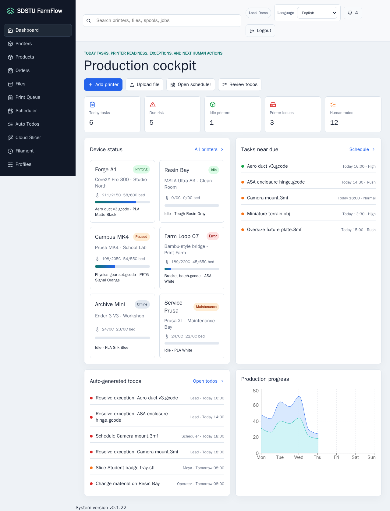
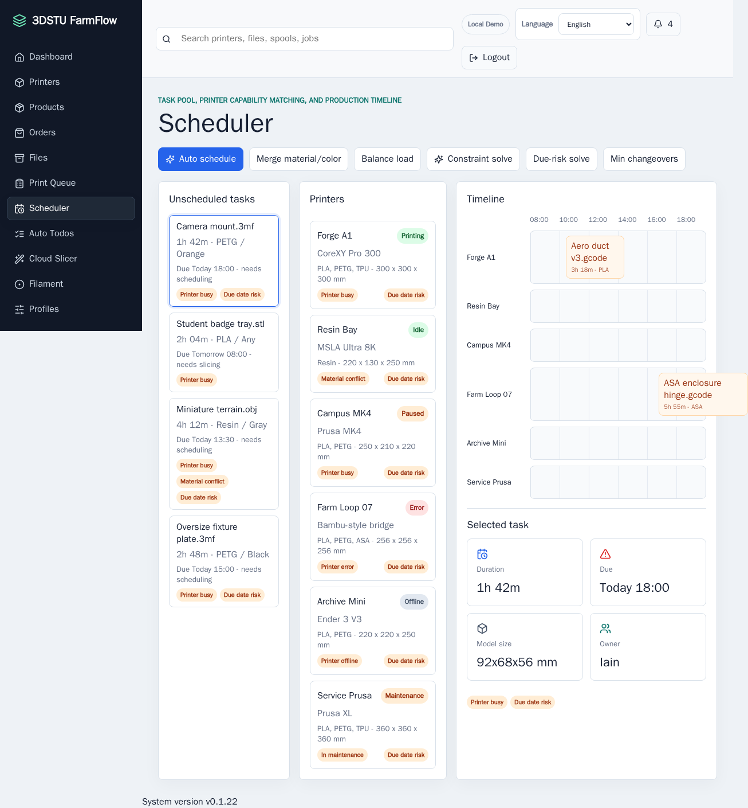
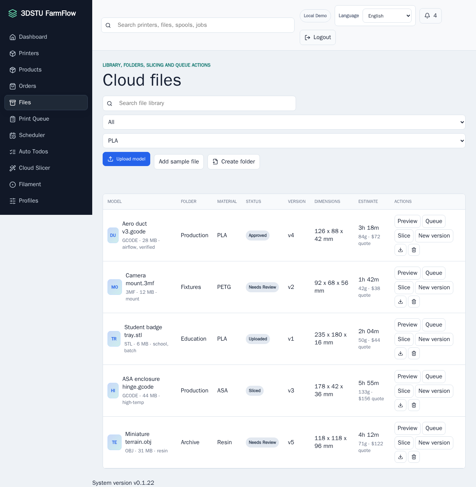
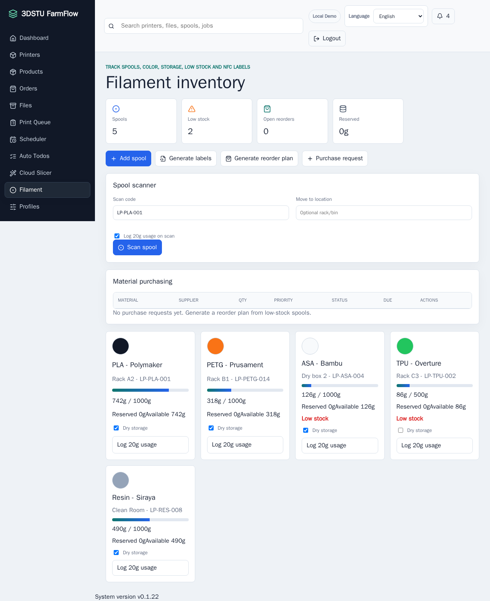
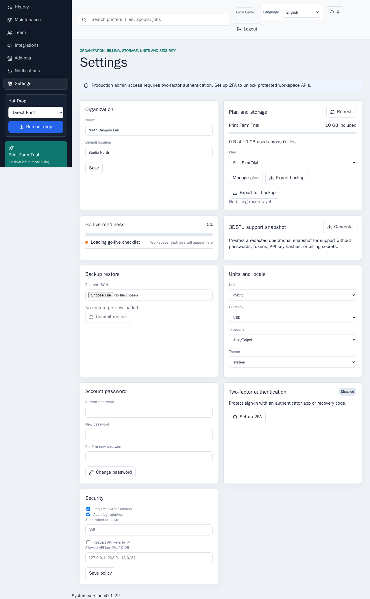

# 3DSTU FarmFlow

[](https://github.com/iain0901/3D-Printing-Farm-System/actions/workflows/ci.yml)

3DSTU FarmFlow is an original 3D printing production operating system MVP for studios, labs, and small print farms. It focuses on structured tasks, model files, printer capability matching, scheduling, automatic todos, and exception-driven operations.

Localized documentation:

- [繁體中文 README](README.zh-TW.md)
- [简体中文 README](README.zh-CN.md)
- [繁體中文授權](LICENSE.zh-TW.md)
- [简体中文许可](LICENSE.zh-CN.md)

For professional technical support or installation services, contact `support@3dstu.com`.

Project links:

- Website: https://farm-saas.3dstu.com
- GitHub: https://github.com/iain0901/3D-Printing-Farm-System
- Installation guide: docs/INSTALL.md
- Operations runbook: docs/OPERATIONS.md
- Product roadmap: docs/ROADMAP.md
- Release runbook: docs/RELEASE.md

## Contents

- [Platform At A Glance](#platform-at-a-glance)
- [Actual Product Screens](#actual-product-screens)
- [Documentation Map](#documentation-map)
- [License](#license)
- [Run Locally](#run-locally)
- [Run With Docker](#run-with-docker)
- [Deploy On Ubuntu](#deploy-on-ubuntu)
- [Hosting Multiple Customer Environments On One Host](#hosting-multiple-customer-environments-on-one-host)
- [Environment Variables](#environment-variables)
- [Production Security And Audit Trail](#production-security-and-audit-trail)
- [API Endpoints](#api-endpoints)
- [Open Source Stack](#open-source-stack)
- [Demo Login](#demo-login)
- [Implemented MVP Areas](#implemented-mvp-areas)
- [Current Integration Boundaries](#current-integration-boundaries)
- [Suggested Real Integrations Later](#suggested-real-integrations-later)
- [Recommended GitHub Topics](#recommended-github-topics)

## Platform At A Glance

3DSTU FarmFlow is built as a production-control layer for real print-farm operations, not just a printer list. The current release-candidate branch includes:

| Area | What the platform handles |
|---|---|
| Intake | Manual orders, quote requests (quick/expert forms with instant estimate), CSV/commerce import, SKU-linked job generation |
| Customers | Customer directory (CRM) auto-linked by email; self-service customer account portal with quote decisions, progress tracking, and two-way messaging |
| Files | STL/3MF/G-code library, versions, previews, generated sample models, slicer outputs |
| Scheduling | Printer matching, material/color constraints, due-risk warnings, load balancing |
| Shop floor | Printer states, queue lifecycle, operator todos, maintenance reports, history/reprints |
| Materials | Spool inventory, reservations, usage scans, reorder planning, label export |
| Operations | Roles, 2FA, audit trail, webhooks, notifications, backups, restore drills, go-live evidence |

## Actual Product Screens

These screenshots are captured from the working local demo UI in this repository.

### Production cockpit



### Scheduler and capacity planning



### Model file library



### Filament and material inventory



### Settings, backup, and governance



## Documentation Map

| Need | Start here |
|---|---|
| Install locally | [Run Locally](#run-locally) |
| Deploy on Ubuntu | [docs/INSTALL.md](docs/INSTALL.md) and [deploy/ubuntu/README.md](deploy/ubuntu/README.md) |
| Operate a live farm, audit trail, and idempotency reference | [docs/OPERATIONS.md](docs/OPERATIONS.md) |
| Decide whether it is ready for production | [docs/PRODUCTION_READINESS.md](docs/PRODUCTION_READINESS.md) |
| Release and go-live flow | [docs/RELEASE.md](docs/RELEASE.md) |
| Product direction | [docs/ROADMAP.md](docs/ROADMAP.md) |
| Platform wiki | [docs/wiki/README.md](docs/wiki/README.md) |

## License

3DSTU FarmFlow is developed by 3DSTU as a free SaaS platform for 3DSTU farm customers. It is source-available under the [3DSTU Farm Customer Source-Available License](LICENSE.md): customers may run, modify, and use it internally to operate their own 3D printing farms and earn revenue from their own printed parts or production services, but may not sell, redistribute, rebrand, host, white-label, or commercially provide the software, modified versions, scripts, Docker images, or related services to third parties without a separate written agreement from 3DSTU.

## Run Locally

```bash
npm install
npm run dev
```

Then open the local Vite URL shown in the terminal, usually `http://127.0.0.1:5173`.

To run the local backend API in another terminal:

```bash
npm run api
```

The API listens on `http://127.0.0.1:8797` and persists data to `api/data/layerpilot.db.json`. See [API Endpoints](#api-endpoints) below for the route reference.

## Run With Docker

Create a production-like environment file, then build and run the container:

```bash
cp .env.example .env
# edit .env and set your real owner email/password
docker compose up --build
```

Then open `http://127.0.0.1:8797`. A few things to know about the Compose setup:

- Compose starts an API/web service plus a `layerpilot-worker` background service from the same image.
- The web container serves the built React app and Fastify API, runs as the non-root `node` user, uses `no-new-privileges`, has a 30-second graceful stop window, per-service JSON log rotation, and a container healthcheck against `/api/health`.
- The worker runs telemetry ticks and OctoPrint/Moonraker/PrusaLink polling, then notifies the API over an internal worker-token endpoint so WebSocket/SSE clients receive fresh state.
- Data is stored in the `layerpilot-data` Docker volume at `/data/layerpilot.db.json`, and uploaded model files are stored under `/data/storage` by default. Set `LAYERPILOT_OBJECT_STORAGE_PROVIDER=s3` to use S3-compatible object storage instead.

## Deploy On Ubuntu

Ubuntu 22.04/24.04 deployment assets live in `deploy/ubuntu/`.

Fast path on a fresh server:

```bash
chmod +x scripts/ubuntu-deploy.sh
LAYERPILOT_ADMIN_EMAIL=owner@example.com \
LAYERPILOT_ADMIN_PASSWORD='replace-with-a-long-password' \
LAYERPILOT_WORKSPACE_NAME='My Print Farm' \
scripts/ubuntu-deploy.sh deploy
```

What `scripts/ubuntu-deploy.sh` does:

- `deploy` creates `.env` with shell/Compose-safe quoted production values, generated worker/metrics tokens, a `LAYERPILOT_PUBLIC_URL` for smoke checks, and a localhost bind by default for Nginx proxying. It then runs a `doctor` preflight (deployment files, private `.env` permissions, production secrets, password/token strength, env value formats, optional S3/Stripe/MQTT config consistency, Compose config) before building services, waiting for readiness, and running smoke checks.
- `update` runs preflight, optional host QC, a verified volume backup, deploy, readiness, and smoke checks — use this for normal releases.
- `rollback <archive.tgz>` restores a known-good volume backup, creating a pre-restore safeguard backup first, then runs readiness/smoke/ops checks automatically.
- `ops-check` verifies services, health endpoints, authenticated state/audit access (when credentials are configured), metrics-token access, backup state, timer state, disk space, and log rotation. `layerpilot-ops-check.timer` can run this every 15 minutes through systemd.
- `support-bundle` generates a redacted troubleshooting archive (OS, Docker, health, logs, backup, timer evidence); secret-like fields and URL paths/query strings are redacted.

Compose uses the project name `layerpilot` by default (override with `COMPOSE_PROJECT_NAME` for co-hosted customer environments), so the persistent Docker volume is `layerpilot_layerpilot-data` unless overridden.

For a public domain with Nginx and HTTPS, follow `deploy/ubuntu/README.md`; after the app is placed under `/opt/layerpilot`, `scripts/ubuntu-setup.sh all your-domain.example owner@example.com` installs base dependencies, UFW firewall rules, Docker log rotation, the backup timer, an ops-check timer, the Nginx site with WebSocket/SSE-friendly proxying and browser security headers, and Certbot HTTPS.

Use `scripts/ubuntu-go-live-check.sh` on the Ubuntu host to load `.env`, run Bash syntax checks, setup preflight, deployment doctor, optional host QC, live smoke checks, verified backup, restore drill, and ops-check in one pass; successful runs write a sanitized `release/go-live-evidence-*.md` report for release handoff, or use `LAYERPILOT_GO_LIVE_REPORT` for a fixed path.

Use `scripts/ubuntu-backup.sh backup` before manual upgrades, `scripts/ubuntu-backup.sh restore-drill <archive.tgz>` to test restores without touching production data, or install `layerpilot-backup.timer` for nightly verified backups with locking and 30-day pruning.

After deployment, run a production smoke check from the host:

```bash
LAYERPILOT_SMOKE_URL=http://127.0.0.1:8797 \
LAYERPILOT_SMOKE_EMAIL=owner@example.com \
LAYERPILOT_SMOKE_PASSWORD=change-this-password \
npm run smoke:prod
```

## Hosting Multiple Customer Environments On One Host

3DSTU FarmFlow is single-tenant per deployment: there is no self-service signup, so every customer gets their own independently provisioned instance with its own bootstrap Owner. `scripts/provision-tenant.sh` scaffolds that environment without touching Docker itself:

```bash
scripts/provision-tenant.sh \
  --slug acme-lab \
  --admin-email owner@acme.example \
  --domain farm.acme.example \
  --host-port 8798
```

This writes a private `tenants/<slug>/<slug>.env` (mode `600`) with a unique `COMPOSE_PROJECT_NAME`, `LAYERPILOT_CONTAINER_NAME`, and `LAYERPILOT_HOST_PORT` plus generated worker/metrics tokens and a generated Owner password (shown once), and an optional Nginx vhost file when `--domain` is given. Each environment's Compose project, container names, host port, and data volume are isolated, so several customers can share one host. Copy the generated `.env` into place (or set `LAYERPILOT_ENV_FILE`) and continue with the normal `scripts/ubuntu-deploy.sh doctor` / `deploy` flow. Use `--dry-run` to preview output without writing files, and `--force` to intentionally rotate an existing environment's secrets.

## Environment Variables

<details>
<summary>Full environment variable reference (click to expand)</summary>

- `LAYERPILOT_HOST`, default `0.0.0.0` in Docker
- `LAYERPILOT_API_PORT`, default `8797`
- `LAYERPILOT_HOST_PORT`, host port published on `LAYERPILOT_BIND_ADDRESS` by Docker Compose, default `8797`; give each co-hosted customer environment a unique value
- `COMPOSE_PROJECT_NAME` and `LAYERPILOT_CONTAINER_NAME`, Compose project and container identity, default `layerpilot`; `scripts/provision-tenant.sh` sets these per customer so multiple environments can share one host without collisions
- `LAYERPILOT_PUBLIC_URL`, public app URL used by smoke checks, links, and production CORS trusted-origin defaults
- `LAYERPILOT_CORS_ORIGINS`, optional comma-separated extra trusted browser origins for cross-origin quote portals or admin frontends; production rejects wildcard or non-HTTP(S) origins
- `LAYERPILOT_DB_PATH`, default `/data/layerpilot.db.json` in Docker
- `LAYERPILOT_DB_ADAPTER`, `json` by default; set to `sqlite` with a `.sqlite` DB path for SQLite-backed document persistence
- `LAYERPILOT_STORAGE_DIR`, default `/data/storage` in Docker
- `LAYERPILOT_OBJECT_STORAGE_PROVIDER`, `local` or `s3`, default `local`
- `LAYERPILOT_S3_BUCKET`, `LAYERPILOT_S3_REGION`, `LAYERPILOT_S3_ENDPOINT`, `LAYERPILOT_S3_PREFIX`, `LAYERPILOT_S3_FORCE_PATH_STYLE`, `LAYERPILOT_S3_ACCESS_KEY_ID`, and `LAYERPILOT_S3_SECRET_ACCESS_KEY`, optional S3-compatible object storage configuration
- `LAYERPILOT_SERVE_STATIC`, set to `true` to serve `dist`
- `LAYERPILOT_ADMIN_EMAIL` and `LAYERPILOT_ADMIN_PASSWORD`, optional bootstrap Owner credentials for first deployment
- `LAYERPILOT_ADMIN_NAME`, optional bootstrap Owner display name
- `LAYERPILOT_WORKSPACE_NAME`, optional workspace name applied during bootstrap
- `LAYERPILOT_DISABLE_DEFAULT_USERS`, set to `true` for fresh production deployments to remove seeded default users
- `LAYERPILOT_DISABLE_DEMO_LOGIN`, set to `true` to prevent auto-creating the demo login
- `LAYERPILOT_SESSION_TTL_HOURS`, user session lifetime, default `168` hours
- `LAYERPILOT_SESSION_IDLE_TIMEOUT_HOURS`, idle user session timeout, default `24` hours
- `LAYERPILOT_AUTH_LOCK_THRESHOLD`, known-account failed login/2FA attempts before temporary lock, default `5`
- `LAYERPILOT_AUTH_LOCK_MINUTES`, temporary known-account auth lock duration, default `15`
- Workspace API-key IP restrictions accept only explicit IPv4 addresses or IPv4 CIDR ranges such as `203.0.113.25` or `203.0.113.0/24`; if restrictions are enabled with an empty or invalid allowlist in production, `/api/readiness` fails until the settings are corrected.
- `LAYERPILOT_METRICS_TOKEN`, optional token for Prometheus-style `/api/metrics` scraping without a user session; production scrapers must send it with the `x-layerpilot-metrics-token` header, not a URL query parameter
- `LAYERPILOT_OPS_EMAIL` and `LAYERPILOT_OPS_PASSWORD`, optional dedicated smoke account for `scripts/ubuntu-deploy.sh ops-check`; blank values fall back to the bootstrap admin credentials
- `LAYERPILOT_AUTO_BACKUP_ON_MIGRATE`, defaults to `true`; writes a sibling `*.pre-migration-*.bak.json` before schema migrations when an existing DB file is upgraded
- `LAYERPILOT_PRE_RESTORE_BACKUP`, defaults to `true`; writes a safeguard volume archive before restore or rollback replaces production data
- `LAYERPILOT_FULL_BACKUP_MAX_BYTES`, default `536870912` (512 MiB); caps `/api/admin/export?includeFiles=true` before stored model/G-code bytes are read into the JSON response, and full exports fail closed when referenced stored files are missing unless `allowMissingFiles=true` is supplied intentionally
- `LAYERPILOT_WORKER_TOKEN`, required for Docker worker-to-API state broadcasts; change the example value before real deployment. In production, worker broadcasts must send it with the `x-layerpilot-worker-token` header, not a URL query parameter.
- `LAYERPILOT_WORKER_TELEMETRY` and `LAYERPILOT_WORKER_BRIDGE_POLLING`, enable or disable background worker jobs; when either is enabled in production, `/api/readiness` fails until the worker has reported a recent heartbeat
- `LAYERPILOT_WORKER_TELEMETRY_INTERVAL_MS` and `LAYERPILOT_WORKER_BRIDGE_POLL_INTERVAL_MS`, background worker intervals used by readiness to calculate worker heartbeat freshness with a minimum 60-second tolerance
- `LAYERPILOT_BILLING_PORTAL_URL`, optional external billing portal destination
- `LAYERPILOT_STRIPE_SECRET_KEY`, optional Stripe API secret key for subscription checkout and billing portal sessions
- `LAYERPILOT_STRIPE_WEBHOOK_SECRET`, required in production when `/api/billing/webhook/stripe` is exposed; direct Stripe calls are verified with the `Stripe-Signature` header, while trusted edge proxies may inject `x-layerpilot-billing-webhook-secret`
- `LAYERPILOT_STRIPE_PRICE_STUDIO`, `LAYERPILOT_STRIPE_PRICE_FARM`, and `LAYERPILOT_STRIPE_PRICE_ENTERPRISE`, optional Stripe recurring price IDs mapped to 3DSTU FarmFlow plans
- `LAYERPILOT_MQTT_URL`, optional MQTT broker URL used by the MQTT Event Stream add-on when it is enabled
- `LAYERPILOT_MQTT_TOPIC_PREFIX`, optional MQTT topic prefix, default `layerpilot`
- `LAYERPILOT_MQTT_USERNAME` and `LAYERPILOT_MQTT_PASSWORD`, optional MQTT broker credentials
- `LAYERPILOT_MQTT_QOS`, optional MQTT QoS value `0`, `1`, or `2`
- `LAYERPILOT_MQTT_RETAIN`, optional `true`/`false` retained-message flag
- `LAYERPILOT_SLICER_CMD`, optional external slicer executable such as PrusaSlicer, OrcaSlicer, or SuperSlicer
- `LAYERPILOT_SLICER_ARGS`, optional JSON array or space-separated args using `{input}`, `{output}`, and `{config}` placeholders
- `LAYERPILOT_SMTP_HOST`, optional SMTP host; when unset, customer portal transactional email (password reset, quote-ready, new-message notices) is silently skipped
- `LAYERPILOT_SMTP_PORT`, SMTP port, default `587`
- `LAYERPILOT_SMTP_SECURE`, optional `true`/`false`; defaults to `true` only when the port is `465`
- `LAYERPILOT_SMTP_USER` and `LAYERPILOT_SMTP_PASSWORD`, optional SMTP credentials
- `LAYERPILOT_SMTP_FROM`, the From address for customer portal transactional email, defaults to `LAYERPILOT_SMTP_USER`

</details>

## Production Security And Audit Trail

The production API enables security headers (`@fastify/helmet`) and route-level rate limiting (`@fastify/rate-limit`) for authentication, API key creation, billing sessions, and admin exports. This is a single-tenant deployment model: there is no self-service signup route, so each customer gets an independently provisioned environment (see [Hosting Multiple Customer Environments](#hosting-multiple-customer-environments-on-one-host)) with its own bootstrap Owner account; additional operators are added from the Team page by that Owner.

- Production CORS reflects only `LAYERPILOT_PUBLIC_URL` plus explicit comma-separated `LAYERPILOT_CORS_ORIGINS`; wildcard and non-HTTP(S) origins fail readiness.
- API-key IP allowlists accept only IPv4 addresses or IPv4 CIDR ranges; an empty or invalid allowlist with restrictions enabled fails production readiness.
- User session and API-key credentials are rejected from URL query parameters in production; browser realtime clients use a short-lived one-time `/api/events/token` ticket for WebSocket/SSE instead of a long-lived bearer token in the URL.
- Stripe billing webhooks are deduplicated by provider `event.id`; duplicate deliveries return `x-layerpilot-stripe-webhook-replay: true` instead of duplicate audit evidence.
- Nearly every retry-prone write API (orders, queue, quotes, customer portal actions, files, printers, catalog, billing, admin, and more) accepts an `Idempotency-Key` header and replays the original response instead of repeating the side effect.
- Every meaningful production action — auth, files, printers, bridges, quotes, orders, customer portal accounts, catalog, inventory, maintenance, integrations, billing, and admin/backup/restore — writes a workspace + operator-scoped audit event that omits secrets, tokens, file contents, and full endpoint URLs.

**For the full audit-event catalog, the complete `Idempotency-Key` route list, session/2FA lockout policy, and backup/restore evidence reference, see [docs/OPERATIONS.md](docs/OPERATIONS.md).** That is the canonical, kept-up-to-date reference; this README only summarizes it.

## API Endpoints

<details>
<summary>Full endpoint reference by domain (click to expand)</summary>

**Health & System**
`GET /api/health` · `GET /api/readiness` · `GET /api/metrics` · `POST /api/internal/worker-broadcast` (internal worker token only)

**Staff Auth**
`POST /api/auth/login` · `GET /api/auth/me` · `POST /api/auth/2fa/setup` · `POST /api/auth/2fa/enable` · `POST /api/auth/2fa/disable` · `POST /api/auth/change-password` · `POST /api/auth/logout`

**Customer Accounts & Portal**
`POST /api/customer-auth/register` · `POST /api/customer-auth/login` · `POST /api/customer-auth/logout` · `GET /api/customer-auth/me` · `POST /api/customer-auth/claim` (set a password from an existing quote ID + tracking token) · `POST /api/customer-auth/request-reset` and `POST /api/customer-auth/reset` (self-service password reset that never reveals whether an email has an account) · `PATCH /api/customer-auth/profile` · `GET /api/customer/quotes` and `GET /api/customer/orders` (scoped to the caller's own records) · `POST /api/customer/quotes/:id/decision` · `POST /api/customer/quotes/:id/messages`

**Customer Directory (CRM)**
`GET /api/customers` · `POST /api/customers` · `PATCH /api/customers/:id` · `DELETE /api/customers/:id`

**Quotes & Orders**
`PATCH /api/quoteRequests/:id` · `POST /api/quoteRequests/:id/messages` (operator side of the two-way message thread) · `POST /api/orders` · `PATCH /api/orders/:id/status` · `PATCH /api/orders/:id/tracking` (shipment carrier/tracking number) · `POST /api/orders/:id/generate-jobs` (optional `{ "dryRun": true }` for SKU/part/stock preflight and duplicate-generation protection)

**Printers & Bridges**
`GET /api/printers` · `POST /api/printers` · `PATCH /api/printers/:id` · `PATCH /api/printers/:id/status` · `POST /api/printers/:id/sync` · `GET /api/bridges` · `POST /api/bridges` · `POST /api/bridges/sync` · `POST /api/bridges/:id/test` · `POST /api/actions` (persisted printer actions: `start`, `pause`, `resume`, `cancel`, `home axes`, `preheat`, `cooldown`, with queue-job sync and optional bridge dispatch)

**Queue & Scheduling**
`GET /api/queue` · `POST /api/queue` · `POST /api/queue/match` · `PATCH /api/queue/:id/schedule` · `PATCH /api/queue/:id/status` · `PATCH /api/queue/:id/priority` · `GET /api/schedule/diagnostics` · `POST /api/schedule/auto` · `POST /api/schedule/optimize` · `POST /api/schedule/constraint` · `GET /api/todos` · `POST /api/todos/:id/action`

**Files & Slicing**
`GET /api/files` · `POST /api/files` · `POST /api/files/upload` · `POST /api/file-folders` · `POST /api/files/sample` · `POST /api/hot-drop` · `GET /api/files/:id/download` · `DELETE /api/files/:id` · `PATCH /api/files/:id/version` · `PATCH /api/files/:id/slice` · `GET /api/slicer/jobs` · `POST /api/slicer/jobs`

**Products & Catalog**
`GET /api/parts` · `POST /api/parts` · `PATCH /api/parts/:id` · `GET /api/skus` · `POST /api/skus` · `PATCH /api/skus/:id` · `GET /api/profiles` · `POST /api/profiles` · `POST /api/profiles/import` · `PATCH /api/profiles/:id` · `DELETE /api/profiles/:id` · `PATCH /api/profiles/:id/default` · `PATCH /api/profile-policy` · `GET /api/costCatalog` (authenticated workspace's pricing catalog) · `PATCH /api/costCatalog` · `POST /api/quotes` · `GET /api/catalog/export` (workspace-scoped SKU/material CSV export with compact `catalog.exported` audit evidence) · `POST /api/catalog/material-map` · `POST /api/parametric/nameplate`

**Inventory & Maintenance**
`GET /api/spools` · `POST /api/spools` · `POST /api/spools/labels` · `GET /api/spools/scan?code=...` · `POST /api/spools/scan` · `PATCH /api/spools/:id` · `PATCH /api/spools/:id/usage` · `GET /api/maintenance` · `POST /api/maintenance` · `PATCH /api/maintenance/:id` · `POST /api/maintenance/templates` · `POST /api/maintenance/reports`

**Integrations (Webhooks, Notifications, Commerce, MQTT)**
`GET /api/webhooks` · `POST /api/webhooks` · `PATCH /api/webhooks/:id` · `POST /api/webhooks/:id/test` · `GET /api/notificationChannels` · `POST /api/notificationChannels` · `PATCH /api/notificationChannels/:id` · `POST /api/notificationChannels/:id/test` · `GET /api/notificationDeliveries` · `GET /api/commerceConnectors` · `POST /api/commerceConnectors` · `PATCH /api/commerceConnectors/:id` · `POST /api/commerceConnectors/:id/test` · `POST /api/commerceConnectors/:id/import` · `GET /api/commerceImports` · `POST /api/commerce/import-csv` · `GET /api/webhookDeliveries` · `GET /api/mqttDeliveries`

**Team & Governance**
`GET /api/users` · `POST /api/users` · `PATCH /api/users/:id` · `POST /api/users/:id/reset-password` · `GET /api/apiKeys` · `POST /api/apiKeys` · `PATCH /api/apiKeys/:id` · `GET /api/workspaceSettings` · `PATCH /api/workspaceSettings` · `GET /api/onboarding` · `PATCH /api/onboarding/:id` · `POST /api/support/snapshot` · `GET /api/addons` · `PATCH /api/addons/:id`

**Billing**
`GET /api/billing` · `PATCH /api/billing/plan` · `POST /api/billing/portal` · `POST /api/billing/webhook/stripe`

**Analytics, History & Audit**
`GET /api/analytics` · `GET /api/history` · `PATCH /api/history/:id` · `POST /api/history/:id/reprint` · `GET /api/audit` (optional `type`, `search`, `limit`, `offset`; responses include raw total, matched count, returned count, `hasMore`) · `GET /api/audit/export` (same filters, scoped CSV export with compact `admin.audit_exported` evidence)

**Realtime, Admin, Backup & Restore**
`GET /api/state` · `GET /api/events` · `GET /api/events/stream` · `GET /api/events/ws` · `POST /api/events/token` · `GET /api/admin/integrity` · `GET /api/admin/export` (optional `?includeFiles=true`; capped by `LAYERPILOT_FULL_BACKUP_MAX_BYTES`, returns `413` with a storage manifest when oversized or `409` when referenced files are missing — use `allowMissingFiles=true` only when a partial JSON backup is intentional) · `POST /api/admin/restore` · `POST /api/admin/audit-retention/run` · `POST /api/telemetry/tick`

</details>

To run the QC suite:

```bash
npm run qc
```

This runs the TypeScript/Vite production build plus API tests. GitHub Actions runs the same QC gate on every push to `main` and every pull request. Release discipline and VPS deployment evidence are documented in `docs/RELEASE.md`.

Before using a customer deployment for live production, complete the checklist in `docs/PRODUCTION_READINESS.md`.

## Open Source Stack

- React, Vite, TypeScript, Recharts, and Lucide React for the app experience.
- Fastify and `@fastify/cors` for the backend API.
- `@fastify/helmet` and `@fastify/rate-limit` for production security headers and sensitive-route throttling.
- `@fastify/multipart` for production model uploads.
- LowDB-compatible persistence with a local JSON adapter for simple development and an optional `node:sqlite` adapter for SQLite-backed document storage.
- AWS SDK S3 client for optional S3-compatible model and G-code object storage.
- JSZip for reading 3MF model packages.
- Stripe's official Node SDK for optional subscription checkout, billing portal sessions, and Stripe-compatible billing webhook handling.
- Nodemailer for optional SMTP-based customer portal transactional email.
- MQTT.js for publishing production events to broker-backed automation systems.
- Zod for API payload validation.
- Native `fetch` bridge adapters for OctoPrint, Moonraker/Klipper, and PrusaLink HTTP APIs.
- Vitest for QC coverage across every API domain — auth, billing, customer accounts/portal, inventory, scheduling, files, printers/bridges, catalog, integrations, backup/restore, and more.

## Demo Login

Use the seeded demo account on the auth screen:

- Email: `demo@layerpilot.test`
- Password: `layerpilot`

The API uses local bearer-token sessions, password hashes, optional TOTP two-factor auth with one-time recovery codes, and role-based write permissions for core production actions. Auth, file, and export actions are written to the audit trail with workspace/user/actor/session context, and responses never include bearer tokens, passwords, TOTP secrets, recovery codes, or other stored secrets. See [Production Security And Audit Trail](#production-security-and-audit-trail) and `docs/OPERATIONS.md` for the full policy.

## Implemented MVP Areas

### Accounts, Security & Customer Portal

- API-backed staff auth, logout, TOTP two-factor enrollment/login/recovery/disable flows, user password changes, admin password resets, local bearer-token sessions, password hashing, role-based permissions, and scoped automation API keys with hashed secrets
- Customer directory (CRM) with API-backed create/update/delete, tags and notes, automatic creation/lookup by email from public quote intake, and a linked view of each customer's quotes, orders, and order value
- Customer account portal with self-service registration, login/logout, claiming portal access from an existing quote link, self-service password reset, and self-service profile editing; signed-in customers see only their own quotes and orders with a staged progress indicator, approve/decline/request-revision on quotes, exchange two-way messages with operators (with an unread-message indicator on the operator side), and see shipment carrier/tracking info once an operator adds it
- Optional SMTP-based customer email notifications for password reset, quote-ready, and new-message events; the feature no-ops when SMTP is not configured
- Single-tenant-per-deployment model: no self-service signup; `scripts/provision-tenant.sh` scaffolds an isolated Docker Compose environment (unique project/container/port/data volume plus a generated Owner bootstrap) for each customer, while schema-versioned workspace scoping isolates state/list APIs, users/API keys/settings/billing/export/audit reads, and workspace-tagged production objects within an instance

### Intake & Sales

- Public quote intake with a Quick-quote/Expert-mode form (use-case presets, process, material, color, print quality, layer height, infill, walls, supports, finishing options, inspection level, rush delivery, and a live instant price estimate), optional customer model uploads, shared file-library storage, automatic model metadata estimates, operator quote review, quote validity windows, customer tracking tokens, public status lookup, shareable/rotatable quote portal links, customer accept/reject/revision decisions, quote-to-order conversion, and attached-model handoff into the production queue
- Orders workspace with API-backed Shopify/Etsy/eBay/manual intake, token-safe and endpoint-redacted commerce connectors, JSON feed import, CSV import, duplicate external-order skipping, import history, SKU mapping, fulfillment status updates, SKU-linked queue job generation, preflight job plans, stock-change previews, catalog-gap warnings, and duplicate job-generation blocking

### Production Floor

- Production cockpit dashboard answering today's tasks, due risk, idle printers, printer issues, and human todos
- Printer list, detail drawer, API-backed add-printer wizard with capability/build-volume capture, and API-backed printer actions that synchronize printer state, active queue jobs, temperatures, progress, audit events, and optional hardware bridges
- Printer states aligned to production usage: `idle`, `printing`, `paused`, `offline`, `error`, and `maintenance`
- Print queue with API-backed status, priority, printer assignment, matching dry-runs, committed queue-to-printer production starts, sortable queue, low-priority queue, automatic matching controls, production slots, bulk actions, and matching inspector
- Scheduler workspace with API-backed drag-to-schedule flow, an automatic scheduling engine, material/color batch optimization, load-balance optimization, `javascript-lp-solver` constraint scheduling for balanced cost/due-risk/changeover objectives, an unscheduled task pool, printer capability list, production timeline, inline selected-task risk summary, stored schedule/material/size/availability/slot-overlap/due-date warnings, and operator-attributed audit events
- Auto Todos workspace generated from task state, slicing needs, scheduling needs, material mismatch, build-volume mismatch, post-processing, due-date risk, printer availability, and exception conditions, with persisted claim, snooze, complete, and reopen actions
- Maintenance dashboard with API-backed jobs, completion updates, reusable templates, issue reports that can generate maintenance jobs, schedules, inventory, and problem tracking

### Files, Slicing & Products

- Cloud files with real multipart model upload, local or S3-compatible stored file bytes, generated sample STL files, API-backed folder records, STL/G-code/3MF metadata parsing, API-backed download/delete with reference protection and storage cleanup, full backup export/restore of stored model and G-code bytes with restore payload coverage checks, API-backed version/slice actions, filters, folders, queue actions, file status, versions, model dimensions, thumbnails, and quote estimates
- Cloud slicer with API-backed slicer jobs, stored G-code output, file metadata updates, internal fallback G-code adapter, and optional external PrusaSlicer/OrcaSlicer/SuperSlicer command hook
- Products workspace with API-backed parts, SKUs, variants, file links, SKU/part/material CSV export, API-backed material alias mapping/normalization across parts, files, and queue jobs, and a parametric nameplate builder that generates stored STL files, quote estimates, and optional linked production parts
- API-backed profile manager for machine, process, and filament presets with Manual creation, Orca-style profile text import, Bambu-style JSON sync/import, update/archive actions, default profile selection for slicer jobs, persisted automatic matching policy, and stored settings metadata
- API-backed Sidebar Hot Drop workflow with persisted upload-only, direct-print, and auto-queue modes that can generate stored sample files, create queue jobs, route unsliced files to slicing, and trigger queue matching for printable files

### Inventory & Analytics

- Filament spool inventory with API-backed add/edit, dry-storage toggles, usage logging, generated printable label sheets, scan-code lookup/usage logging, low-stock warnings, and color swatches
- Analytics dashboard backed by `/api/analytics`, live summary cards, charts, material mix, success trend, and CSV export
- Print history backed by `/api/history`, API-backed issue notes, exception flags, reprint generation, and annotation audit events

### Integrations & Platform

- Team users with API-backed invites, temporary passwords, admin password reset, password-reset-required indicators, role/location updates, owner-protection guardrails, permissions, and organization/location fields
- Integrations: API-backed scoped API key creation/disable flow, endpoint-redacted webhook configuration, test delivery, production-event webhook delivery, and delivery log
- API-backed OctoPrint, Moonraker, and PrusaLink bridge configuration, key-safe and endpoint-redacted bridge listing, connection tests, manual sync, background polling sync, status broadcasting, and bridge-aware printer actions with persisted local state transitions
- Production background worker process for telemetry ticks and OctoPrint/Moonraker/PrusaLink polling, with durable worker heartbeat metadata and internal token-protected API rebroadcasts for WebSocket/SSE clients
- Authenticated WebSocket realtime channel for production state snapshots, events, heartbeats, telemetry ticks, bridge sync updates, and notification delivery updates, with the browser console using WebSocket first and SSE as a fallback
- Add-ons marketplace with commerce connectors, workspace-scoped API-backed cost catalogs, API-backed audit timeline with workspace/operator context, CSV export, manual audit-retention enforcement, configurable MQTT event publishing, and mobile console toggles
- PWA mobile console assets with installable manifest, maskable SVG icon, production service worker registration, static app-shell caching, offline fallback page, and API network-only handling to avoid stale production data
- Notification center with endpoint-redacted API-backed Slack, Discord, custom webhook, and email-provider webhook channel configuration, test delivery, production-event delivery, and delivery log
- API-backed settings for organization, billing plan, real storage usage, units, currency, timezone, theme, user password change, two-factor auth setup, security policy with audit retention days and API key IP/CIDR allowlists, internal/external/Stripe billing sessions, signed Stripe webhook-synced subscriptions and invoices, admin JSON backup export, full file backup export, and safe restore preview/commit
- Schema-versioned JSON/SQLite document persistence with automatic startup migrations, migration history, pre-migration backup files, readiness-linked data integrity checks, admin integrity reports for broken references, and configurable audit retention
- English / Traditional Chinese / Simplified Chinese language switcher with cleaned core production translations and a Vitest translation-coverage gate for visible static UI text
- Backend connection indicator with authenticated API hydration from `/api/state` when the local API is running
- Server-sent realtime state stream from `/api/events/stream`, with backend telemetry ticks updating production progress and completion-driven todos

## Current Integration Boundaries

- Printer hardware can be driven through OctoPrint, Moonraker, or PrusaLink bridges when configured; otherwise demo telemetry uses API timers in single-process mode or the Docker worker process in production-style deployments.
- API routes are real Fastify endpoints with schema-versioned JSON or SQLite-backed persistence, automatic migrations, security headers, route-level throttling, auth (staff + customer accounts), TOTP challenges, readiness checks, protected metrics, scoped API-key auth, realtime streaming (SSE/WebSocket), object storage, and the full validation/business-logic layer described above. See `docs/OPERATIONS.md` for the exhaustive route-by-route reference.
- Some offline fallback paths still use local state for instant feedback when the local API is unavailable.
- OctoPrint, Klipper/Moonraker, and PrusaLink bridges can be configured, tested, manually synced, background-polled, broadcast to the realtime stream, and used for basic printer actions through the local API. Webhooks, notification channels, and the MQTT Event Stream add-on can be configured and delivered for matching production events. Commerce connectors can test and import JSON/CSV order feeds with stored bearer tokens hidden from the UI. Cloud-bridge and some marketplace integrations still have UI flows but do not transmit external data yet.

## Suggested Real Integrations Later

- For very large plants, swap the built-in `javascript-lp-solver` planner for a dedicated CP-SAT/OR-Tools worker with labor shifts, multi-day capacity calendars, and hundreds-to-thousands of queued jobs.
- Add a normalized Postgres schema with row-level security for larger multi-tenant scale beyond the current JSON/SQLite document-store tenancy.
- Add object-storage lifecycle policies, CDN downloads, malware scanning, and signed temporary download URLs for public-facing customer portals.
- Move long-running external slicer jobs into isolated worker containers when production farms need queued asynchronous slicing at scale.
- Add organization-level RBAC on the backend.

## Recommended GitHub Topics

`print-farm`, `3d-printing`, `saas`, `self-hosted`, `manufacturing`, `production-planning`, `printer-tools`, `inventory-management`, `job-queue`, `docker`, `typescript`, `react`.
